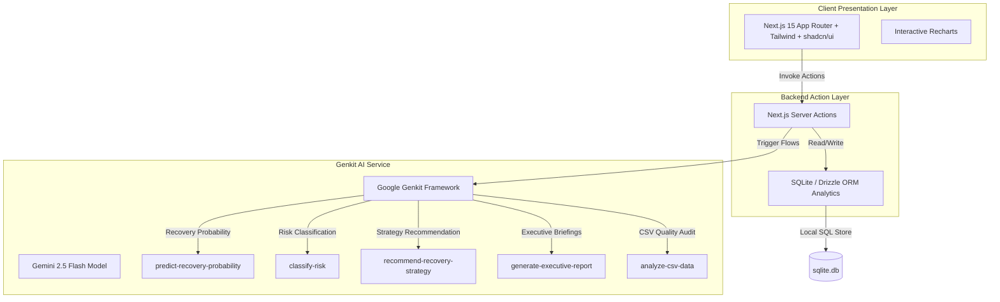

# RecoveryOS — Enterprise Recovery Intelligence Platform

RecoveryOS is a production-grade, portfolio-quality AI-powered debt recovery intelligence platform designed for FedEx. It optimizes debt collection agency (DCA) performance, prioritizes ledger receivables, automates case analysis, and accelerates cash flow recovery.

---

## 🏛️ Platform Architecture

RecoveryOS is built on a modern, robust, high-density full-stack architecture using Next.js 15, Drizzle ORM + SQLite, Tailwind CSS, and Google Genkit integrated with Gemini 2.5 Flash for cognitive decision intelligence.



---

## 🖥️ Screen Walkthroughs & Layouts

Below are the key interfaces of the RecoveryOS platform, showcasing the modern Stripe/Linear-inspired dark UI layouts:

### 1. Recovery Command Center (Dashboard)
The main hub features a high-density, real-time KPI ribbon tracking overall portfolio health, side-by-side panels for Case Prioritization, and a Live System Activity & Alerts feed highlighting SLA breaches and automated escalations.


### 2. Recovery Portfolio (Cases Page)
An interactive grid that houses all collection accounts. It features filtering tabs for account status, a 4-card KPI ribbon summary of current cases, and an inline AI Recommendation workspace drawer for fast audits.


### 3. Recovery Intelligence Workspace (Case Details Page)
A single-case cognitive command workspace. It includes dynamic status dropdowns, recovery radial gauges, risk classification indicators, an audit checklist, timeline updates, and direct Gemini-powered AI Audits.


### 4. Agency Operations Hub (DCA Portal)
Tailored to manage and track partner agencies (DCAs). Includes leaderboards tracking overall recovery rate performance, active case distributions, average recovery times, and active SLA trackers.


### 5. Executive Intelligence (Reports Page)
Provides C-Suite executives with a clean, high-density dashboard tracking payment recoveries over time, alongside a compiler to generate and download AI-generated executive markdown briefings.


### 6. Portfolio Ingestion Center (Import Page)
The CSV data importing workspace. Features dynamic validations, mapping fields, and a cognitive CSV auditor that scans inputs for structural compliance, missing parameters, and layout issues before DB insertions.


---

## 🧠 AI Workflows & Prompts (Genkit + Gemini)

RecoveryOS leverages **Google Genkit** and the **Gemini 2.5 Flash** model with strongly-typed Zod schemas to run five distinct cognitive workflows:

1. **Recovery Probability Prediction (`predict-recovery-probability`)**: Analyzes debtor history, age of case, ledger balances, and payment patterns to produce a percentage success rating.
2. **Risk Classification (`classify-risk`)**: Ranks accounts into `Low`, `Medium`, `High`, and `Critical` risk tiers, detailing risk indicators and suggested actions.
3. **Recovery Strategy Recommendation (`recommend-recovery-strategy`)**: Prescribes optimal communication channels (email, call, letter), settlement discount limits, and compliance actions.
4. **Executive Briefing Generator (`generate-executive-report`)**: Compiles active database stats, monthly trend matrices, and partner agency metrics into a downloadable markdown report.
5. **CSV Profiler & Auditor (`analyze-csv-data`)**: Profiles csv imports, highlighting invalid column entries, layout issues, or mismatched values.

---

## 💾 Database Schema (SQLite + Drizzle)

The local SQLite relational database contains the following tables:

*   **`users`**: Manages credentials, roles (`Admin` | `Analyst` | `DCA_Agent`), and assigned agency.
*   **`dcas`**: Profiles partner Collection Agencies, recording recovery rates, volume allocations, rankings, and active SLAs.
*   **`cases`**: Ledger files storing debtor info, outstanding amounts, custom status, risk tier, probability, and action plans.
*   **`payments`**: Records of all recovery transactions, date stamps, and settlement percentages.
*   **`sla_tracking`**: Stores service level agreement deadlines, breach conditions, and monitoring milestones.
*   **`audit_logs`**: Registers user and AI operations for absolute platform transparency.

---

## ⚙️ Setup & Installation

### Prerequisites
*   Node.js (v18 or higher)
*   A Google Gemini API key (`GOOGLE_API_KEY`)

### Instructions

1.  **Clone the Repository**
    ```bash
    git clone https://github.com/sunnysuhas/Swift-recovery-fedex.git
    cd Swift-recovery-fedex
    ```

2.  **Install Dependencies**
    ```bash
    npm install
    ```

3.  **Configure Environment**
    Create a `.env.local` file in the project root:
    ```env
    GOOGLE_API_KEY=your_gemini_api_key_here
    ```

4.  **Database Migration & Seeding**
    Set up the local SQLite database and seed initial mock records:
    ```bash
    npm run db:push
    npm run seed
    ```

5.  **Start the Local Server**
    ```bash
    npm run dev
    ```
    The application will be accessible at `http://localhost:9002`.

6.  **Run Genkit Developer UI (Optional)**
    To explore or test flows in the Genkit Playground:
    ```bash
    npm run genkit:dev
    ```
